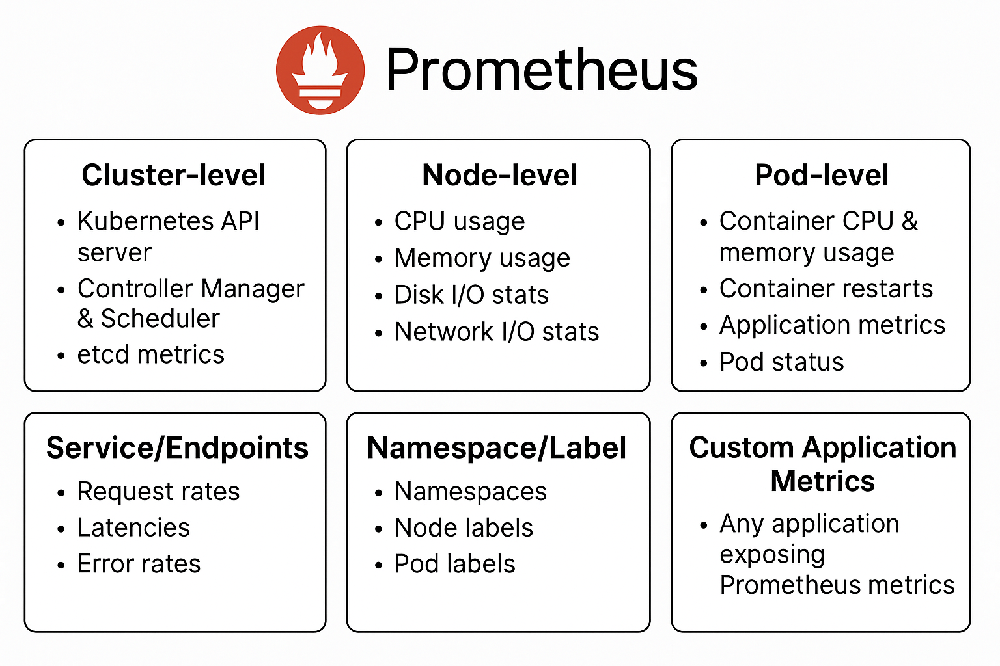

# Prometheus



## Prometheus Monitoring Itself
```yml
apiVersion: v1
kind: ConfigMap
metadata:
  name: prometheus-config
  namespace: monitoring
data:
  prometheus.yml: |
    global:
      scrape_interval: 15s
      evaluation_interval: 15s

    scrape_configs:
      - job_name: 'prometheus'
        static_configs:
          - targets: ['prometheus.monitoring.svc.cluster.local:9090']
```

## Common Queries

**1. Prometheus / Self Monitoring**
| Metric            | Query                                                     | Description                            |
| ----------------- | --------------------------------------------------------- | -------------------------------------- |
| Prometheus uptime | `process_uptime_seconds`                                  | How long Prometheus has been running   |
| TSDB blocks       | `prometheus_tsdb_head_series`                             | Number of time series in memory        |
| Scrape duration   | `scrape_duration_seconds{job="prometheus"}`               | Time taken to scrape Prometheus itself |
| Scrape errors     | `scrape_samples_post_metric_relabeling{job="prometheus"}` | Number of samples after relabeling     |

**2. API Server monitoring**
| Metric            | Query                                                                                                        | Description              |
| ----------------- | ------------------------------------------------------------------------------------------------------------ | ------------------------ |
| API request rate  | `rate(apiserver_request_total[5m])`                                                                          | Requests per second      |
| API errors        | `rate(apiserver_request_total{code=~"5.."}[5m])`                                                             | 5xx error rate           |
| Request latency   | `histogram_quantile(0.95, sum(rate(apiserver_request_duration_seconds_bucket[5m])) by (verb, resource, le))` | 95th percentile latency  |
| API server uptime | `up{job="kubernetes-apiservers"}`                                                                            | Whether API server is up |

**3. Nodes / Cluster Level**
| Metric             | Query                                                                             | Description           |
| ------------------ | --------------------------------------------------------------------------------- | --------------------- |
| CPU usage per node | `sum(rate(node_cpu_seconds_total{mode!="idle"}[5m])) by (instance)`               | CPU used by each node |
| CPU usage %        | `100 - (avg by (instance) (rate(node_cpu_seconds_total{mode="idle"}[5m])) * 100)` | CPU utilization %     |
| Memory usage       | `node_memory_MemTotal_bytes - node_memory_MemAvailable_bytes`                     | Memory used per node  |
| Disk usage         | `node_filesystem_size_bytes - node_filesystem_free_bytes`                         | Disk usage per node   |
| Node up            | `up{job="node-exporter"}`                                                         | Node Exporter running |

**4. Pods**
| Metric               | Query                                                                | Description                  |
| -------------------- | -------------------------------------------------------------------- | ---------------------------- |
| CPU usage per pod    | `sum(rate(container_cpu_usage_seconds_total{pod!=""}[5m])) by (pod)` | CPU used by each pod         |
| Memory usage per pod | `sum(container_memory_usage_bytes{pod!=""}) by (pod)`                | Memory used per pod          |
| Restart count        | `kube_pod_container_status_restarts_total`                           | Number of container restarts |
| Pod ready status     | `kube_pod_status_ready{condition="true"}`                            | Pods in ready state          |

**Services**
| Metric               | Query                                                                                                        | Description                     |
| -------------------- | ------------------------------------------------------------------------------------------------------------ | ------------------------------- |
| Service request rate | `rate(http_requests_total{service="myservice"}[5m])`                                                         | Requests per second per service |
| Service errors       | `rate(http_requests_total{service="myservice",status=~"5.."}[5m])`                                           | 5xx errors per service          |
| Service latency      | `histogram_quantile(0.95, sum(rate(http_request_duration_seconds_bucket{service="myservice"}[5m])) by (le))` | 95th percentile latency         |

**Cluster / Workload Summary**
| Metric       | Query                                           | Description                |
| ------------ | ----------------------------------------------- | -------------------------- |
| Total nodes  | `count(kube_node_info)`                         | Number of nodes in cluster |
| Total pods   | `count(kube_pod_info)`                          | Number of pods in cluster  |
| Pending pods | `count(kube_pod_status_phase{phase="Pending"})` | Pods not yet scheduled     |
| Running pods | `count(kube_pod_status_phase{phase="Running"})` | Pods currently running     |
| Failed pods  | `count(kube_pod_status_phase{phase="Failed"})`  | Pods in failed state       |

